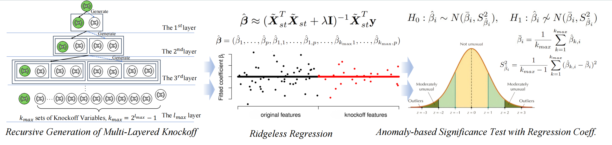

# Knoop: Practical Enhancement of Knockoff with Over-Parameterization for Variable Selection

**Official implementation of the paper "Knoop: Practical Enhancement of Knockoff with Over-Parameterization for Variable Selection" with PyTorch.**

This repository contains the code and data for **Knoop**, a novel approach to feature selection that enhances the standard Knockoff framework. By leveraging recursive generation of multi-layered knockoff variables and incorporating a Ridgeless regression model, this method improves model fitness and ensures stable variable selection. Additionally, **Knoop** employs an anomaly-based significance test for FDR control, addressing the limitations of traditional knockoff methods. Extensive experiments demonstrate the superior performance of **Knoop** over existing methods on both simulated and real-world datasets. 

The paper was published in *Machine Learning* on 17 January 2025, Volume 114, article number 26.



## Table of Contents
- [Background](#background)
- [Data Sources](#data-sources)
- [Installation](#installation)
- [Usage](#usage)
- [Project Structure](#project-structure)
- [License](#license)
- [References](#references)

## Preprint Version
For the preprint version of the paper "Practical Enhancement of Knockoff with Over-Parameterization for Variable Selection", see this [pdf](https://arxiv.org/abs/2501.17889).

## Data Sources
- Alon dataset: [CRAN AlonDS](https://search.r-project.org/CRAN/refmans/HiDimDA/html/AlonDS.html)
- Superconductivity dataset, Energy dataset, Community and Crime dataset: [UCI Machine Learning Repository](https://archive.ics.uci.edu/datasets)

## Installation
The following Python libraries are required to run the code in this repository:

- choldate==0.1.0
- knockpy==1.3.1
- matplotlib
- pandas
- scikit-learn
- scipy==1.10.1
- seaborn==0.13.2
- skfeature==1.0.0
- statsmodels
- torch==2.3.0
- torchaudio==2.3.0+cu121
- torchvision==0.18.0
- tqdm
- xgboost==2.1.0

You can install these dependencies using:
```bash
pip install -r requirements.txt
```
Additionally, the following R package is required:
- multiknockoffs:  https://github.com/cKarypidis/multiknockoffs

To install the R package, run:
```R
# In an R console
install.packages("devtools")
devtools::install_github("cKarypidis/multiknockoffs")
```

## Usage
To run the simulation experiments, use the following command:
```bash
python scripts/simulations/classical scenarios/p=80,p_real=10,n=100/repeats.py
```
To run the real dataset experiments, use the following command:
```bash
python scripts/real_data_experiments/superconductivity/get_everything_about_BestKFeatures.py
```
Make sure to prepare the data according to the instructions in the data/readme.txt.

## Project Structure
```plaintext
Knoop-Knockoff-Enhancement/
├── README.md
├── LICENSE
├── requirements.txt
├── data/
│   ├── Alon dataset/
│   ├── community_and_crime_dataset/
│   ├── energy_data_dataset/
│   └── superconductivity_dataset/
├── scripts/
│   ├── simulations/
│   │   ├── classical_scenarios/
│   │   └── HDLSS_scenarios/
│   └── real_data_experiments/
│       ├── Alon_dataset/
│       ├── community_and_crime_dataset/
│       ├── energy_data_dataset/
│       └── superconductivity_dataset/
└── results/
    ├── simulations/
    └── real_data_experiments/
```

## Citation

If you use the code or the data for your research, please cite our paper as follows:

```bibtex
@article{zhang2025knoop,
  title={Knoop: practical enhancement of knockoff with over-parameterization for variable selection},
  author={Zhang, Xiaochen and Cai, Yunfeng and Xiong, Haoyi},
  journal={Machine Learning},
  volume={114},
  number={1},
  pages={26},
  year={2025},
  publisher={Springer}
}
```

## License
This project is licensed under the MIT License. See the LICENSE file for details.

